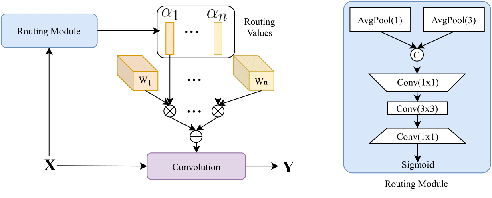
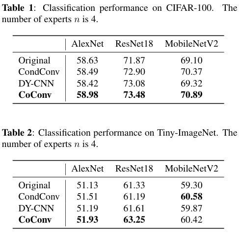
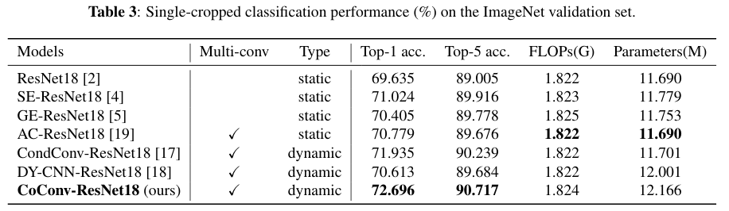

# CoConv: Learning Dynamic Cooperative Convolution For Image Recognition

CoConv is trained by using multiple convolutional experts simultaneously, and the convolutional weights are merged by a weighted summation before convolutional operations for efficiency during inference. Results from extensive experiments show that CoConv leads to consistent improvement for image classification on various datasets, independent of the choice of the base convolutional network. Remarkably, CoConv improves the top-1 classification accuracy of ResNet18 by **3.06%** on ImageNet.

### Performance on CIFAR-100 and Tiny ImageNet

### Performance on ImageNet with ResNet18 backbone

### Running the Training

[Install PyTorch and related packages](https://pytorch.org/get-started/previous-versions/). We use PyTorch 1.4.0 for our experiments.

[Download Tiny ImageNet](https://www.kaggle.com/c/tiny-imagenet). Run `python3 foo.py` to refactor the dataset folder. Remember to change the `DIR` variable in `foo.py` accordingly.

To train, run

    python3 train.py --network <network_name> --dataset <cifar100 or tiny>

To train on ImageNet, go into the `imagenet` folder, change the dataset path in the argument parser and run `python3 imagenet.py`.